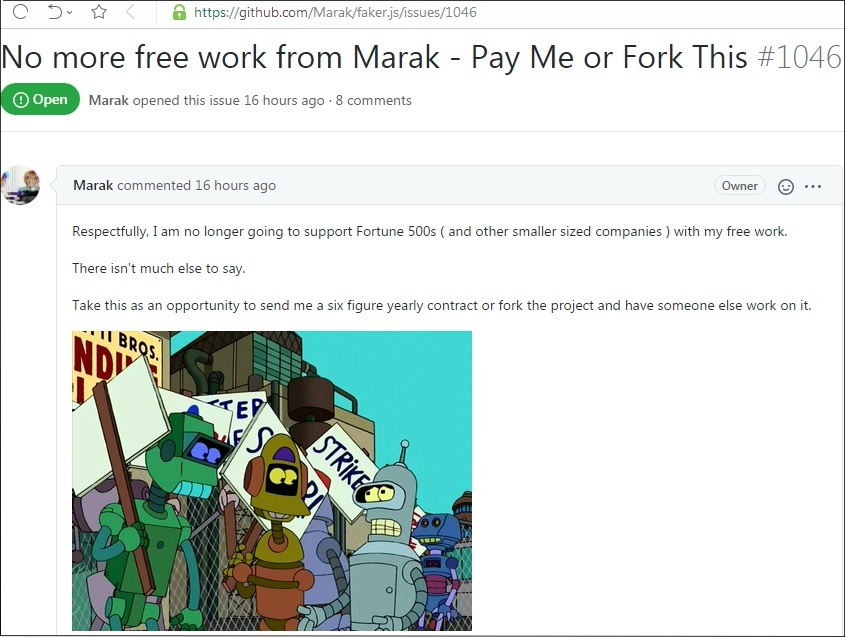

##### (D9/M11/2020)

## 
 Github Strike 

https://news.ycombinator.com/item?id=25032105

 

### 
 Unpaid Interns 

https://landshark.io/2020/11/09/no-free-features.html

## 
 ... 

 

 ------------------------------------------------------------------------------- 

### Howdy! 👋

- Working on: This profile page! (https://github.com/kustomzone/kustomzone)
- Watching: 
 Hackernews (https://news.ycombinator.com/) 

            
 Worldometer (https://worldometers.info/coronavirus/) 

## Study Links

- Github profile topic: https://news.ycombinator.com/item?id=23807881
- Profile Page Auto-updating: https://simonwillison.net/2020/Jul/10/self-updating-profile-readme/

- Web3Torrent: https://web3torrent.statechannels.org/
- Deno Land:   https://deno.land/std/wasi/README.md
- Caffine:     https://github.com/ccrraaiigg/caffeine
